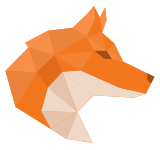
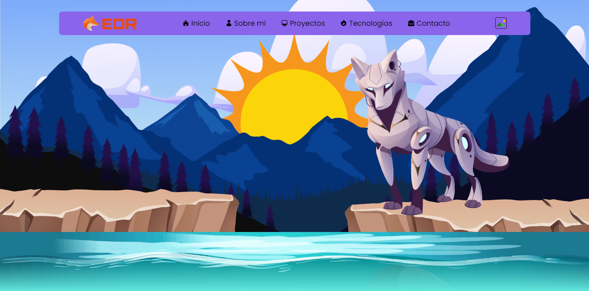
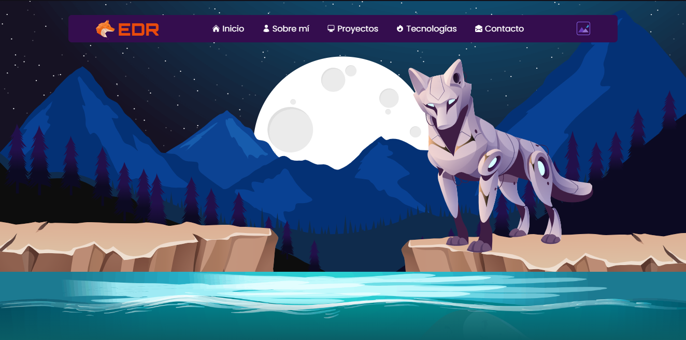
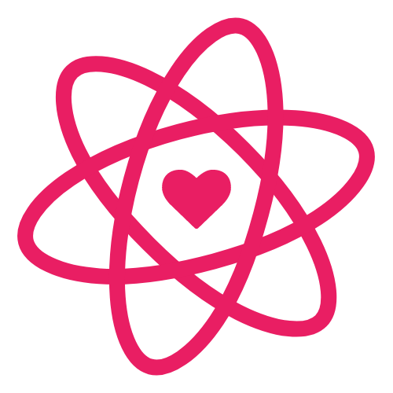
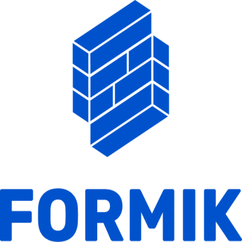
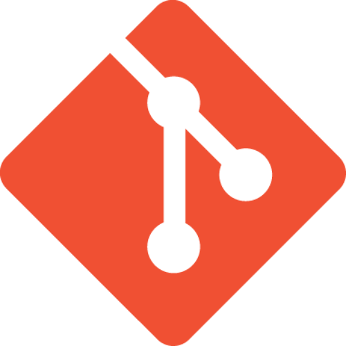
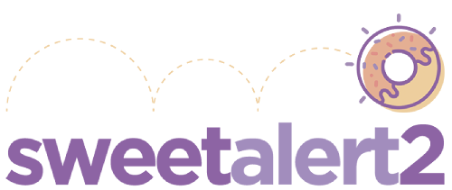

# ✨ Mi Portafolio

  

## 🔶 Acerca del proyecto

Este proyecto es mi portafolio web donde podras encontrar información sobre mi perfil profesional.

## 🔶 Imagenes del proyecto

- Home Light theme.

- Home Dark theme.

## 🔶 Tecnologías y herramientas utilizadas

  
  
  
  
  
  
  
  

## 🔶 Normas ESLint durante el desarrollo

  
  

## 🔶 Creditos de imágenes

<a href="https://www.freepik.es/vector-gratis/animales-mecanicos-robots-aguila-panda-lagarto-perro-foca-conjunto-dibujos-animados-vectoriales-mascotas-mecanicas-futuristas-pajaros-metal-reptiles-osos-lobos-leones-marinos-cyborgs-maquinas-electronicas_22273261.htm#query=wolf&position=22&from_view=search&track=sph" target="_blank">Imagen de upklyak</a> en Freepik

<a href="https://www.freepik.es/vector-gratis/lindo-astronauta-montando-cohete-agitando-mano-icono-dibujos-animados-ilustracion-concepto-icono-tecnologia-ciencia_10764053.htm#query=rocket&position=40&from_view=search&track=sph" target="_blank">Imagen de catalyststuff</a> en Freepik

<a href="https://www.freepik.es/vector-gratis/lindo-astronauta-bailando-ilustracion-icono-vector-dibujos-animados-cohete-icono-ciencia-tecnologia-aislado_31789043.htm#page=20&position=1&from_view=author" target="_blank">Imagen de catalyststuff</a> en Freepik

Imagen de <a href="https://www.freepik.es/vector-gratis/fondo-constelacion-abstracta-gradiente_5441235.htm#query=stars&position=3&from_view=search&track=sph" target="_blank">Freepik</a>

Imagen de <a href="https://www.freepik.es/vector-gratis/fondo-paisaje-luna-llena_1107751.htm#query=moon&position=19&from_view=search&track=sph" target="_blank">Freepik</a>

<a href="https://www.freepik.com/free-vector/natural-environment-lanscape-scene_5837826.htm" target="_blank">Image by brgfx</a> on Freepik

<a href="https://www.flaticon.com/free-icons/united-states" title="united states icons">United states icons created by Freepik - Flaticon</a>

<a href="https://www.flaticon.com/free-icons/flags" title="flags icons">Flags icons created by Freepik - Flaticon</a>